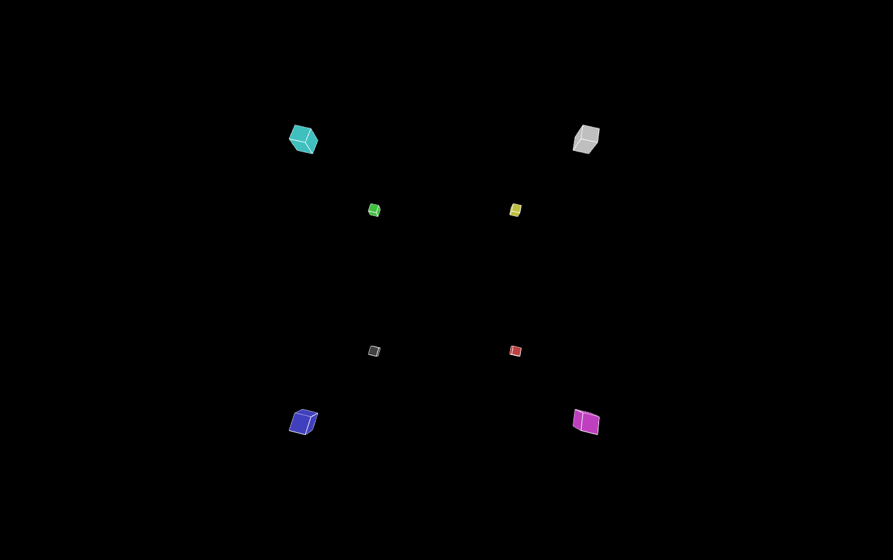

# CS174A Assignment 1

> WebGL animation with 8-cube display and manual camera adjustment via keyboard 

## Description 



The latest version is v1.6.
WebGL boilerplate was adapted using code from Mozilla's WebGL tutorial. 
The canvas is set to 1440 x 990, and the camera is intially 
30 units away from the scene. 

The matrix library used to perform mathematical calculations is gl-matrix. 
For documentation, visit http://glmatrix.net/docs/

Code for this project is broken into four main files

- `index.html`:		- Sets up the canvas, location of vertex and fragment shaders
- `cubes.js`: 		- Renders the scene upon loading of webpage, handles 
					keyboard events, defines prototypes for cube object and 
					crosshair object. 
- `gl-matrix.js`: 	- Matrix library 
- `webgl-utils.js`:	- WebGL utility functions provided by Google 

All basic requirements of the assignment were implemented.

All extra credit items were attempted. 

1 - All eight cubes were instanced from the same cube object  

2 - Cubes were defined using the triangle strip primitve

3 - Rotation of the camera was implemented using quaternions 

4 - Each cube rotates at 20rpm and scales from 80% to 120% its size  

## Usage

Clone or download the repository and change into the directory.  
Start by firing up a local webserver in the directory.  
If using Python 2.7.x, replace http.server with SimpleHTTPServer  

```sh
$ python3 -m http.server 

```

Open up localhost:8000 in a browser of choice. 

##### Camera options description:

- `ArrowUp`      	- Move up
- `ArrowDown`      	- Move down 
- `ArrowLeft`      	- Rotate left
- `ArrowRight`      - Rotate right
- `c`				- Cycle cube colors 
- `i`      			- Move forward
- `j`      			- Move left
- `k`      			- Move right
- `m`      			- Move backward
- `r`      			- Reload default view
- `n`      			- Narrow horizontal field of view
- `w`      			- Widen horizontal field of view
- `+`      			- Toggle an orthographic crosshair centered in scene

## Requirements
- WebGL-supported broser 

## Contribution
Pull requests are welcome, along with any feedback or ideas.


